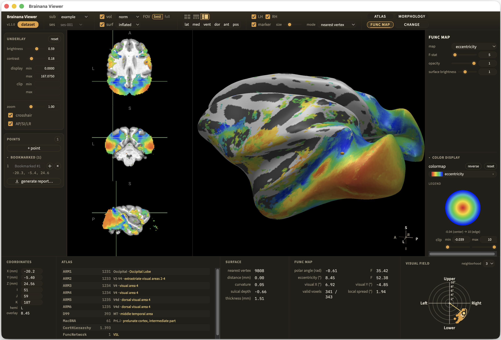
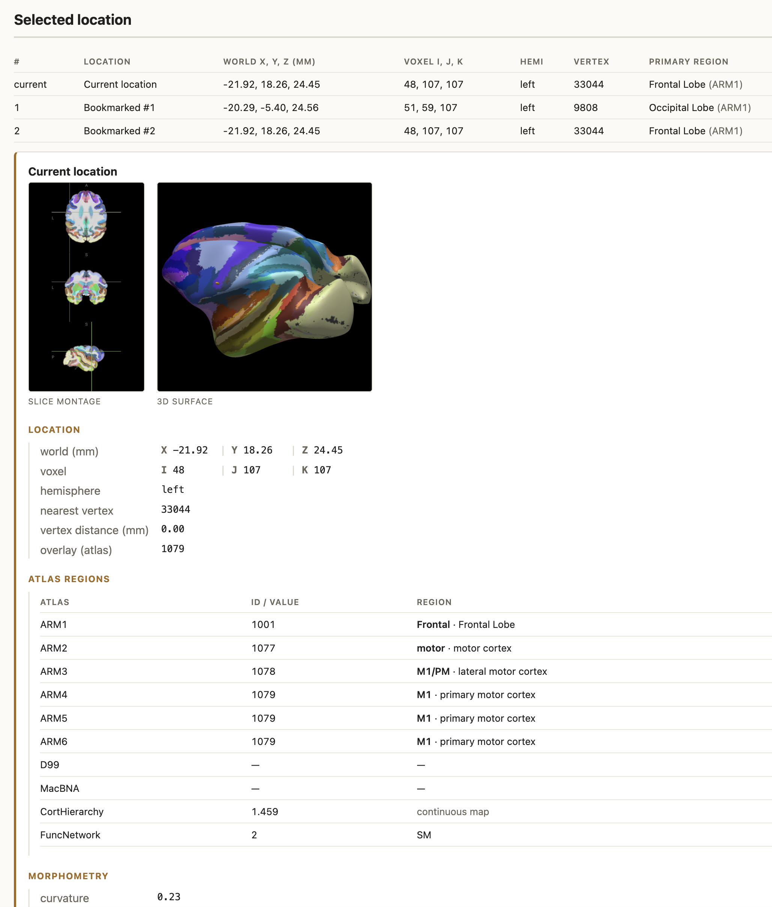

<p align="center">
  
</p>

# Brainana Viewer

**Brainana Viewer** is a free, cross-platform desktop app for exploring **macaque brain MRI**.

Open anatomical volumes, 3D cortical surfaces, atlases, and functional maps produced by the
[**Brainana**](https://github.com/brainana/brainana) preprocessing pipeline
([preprint](https://www.biorxiv.org/content/10.64898/2026.06.03.729972v1)).
The app is built on [NiiVue](https://github.com/niivue/niivue) and WebGL2, and runs on **macOS,
Windows, and Linux**.

[](LICENSE)

## Features

<p align="center">
  
</p>

- **Volume & surface views** — Browse volume slices and rotate 3D cortical surfaces.
- **Surface morphometry** — Shade the cortex by curvature, depth, or thickness.
- **Atlases & regions** — Overlay parcellations automatically and read the region under the cursor.
- **Functional maps** — Display retinotopy and somatotopy on both volume and surface.
- **Local or remote data** — Load datasets from your computer or from a lab workstation over SSH/SFTP.
- **Compare subjects** — Switch between animals while keeping your view settings.
- **Multiple reconstructions** — Subjects processed at Brainana's `session` or `session_longitudinal`
  level include several reconstructions; the **scan** picker lists each one, grouped into
  cross-sectional and longitudinal runs.
- **Longitudinal change maps** — For multi-timepoint subjects, visualize per-vertex rate, temporal
  mean, and percent change fitted by Brainana, with a magnitude threshold and a per-ROI summary table.
- **HTML reports** — Bookmark locations and export a self-contained report with file provenance,
  region and measurement readouts, and screenshots.

## Download & install

Download the build for your platform from the **[Releases page](../../releases/latest)**.

| Your system | Download |
| ----------- | -------- |
| **macOS — Apple Silicon** (M1/M2/M3…) | `brainana-viewer-*-arm64.dmg` |
| **macOS — Intel** | `brainana-viewer-*-x64.dmg` |
| **Windows** | `brainana-viewer-setup-*-x64.exe` |
| **Linux** | `brainana-viewer-*-x86_64.AppImage` or `brainana-viewer_*_amd64.deb` |

> **First launch:** The app is currently **unsigned**, so macOS and Windows may warn that it comes
> from an unidentified developer. You only need to approve it once.
>
> - **macOS:** Double-click the app. If it is blocked, open **System Settings → Privacy &
>   Security**, scroll to **Security**, and click **Open Anyway** (confirm with your password).
>   *(On macOS Sequoia and later, the old right-click → Open shortcut no longer works — use this
>   path instead.)*
> - **Windows:** On the SmartScreen prompt, choose **More info → Run anyway**.
> - **Linux (AppImage):** If double-clicking shows *"no application installed for AppImage… files"*,
>   mark the file executable — right-click → **Properties → Permissions → Allow executing file as
>   program**, or run `chmod +x brainana-viewer-*.AppImage && ./brainana-viewer-*.AppImage`.
>   *(The `.deb` package does not require this step.)*

Not sure which Mac chip you have? Open **Apple menu → About This Mac**.

No account or sign-up is required. When you launch the app, you see a welcome screen with no data
loaded — add a dataset to begin (see [Quick start](#quick-start)).

## Quick start

The app opens on a welcome screen with nothing loaded. To get started:

1. **Add a dataset.** Click **dataset** (top-left) and point the Viewer at a **Brainana output
   directory** — a folder that contains `sub-*` subject folders. You can use a **local** path or a
   **remote** workstation over **SSH/SFTP**. You may add more than one dataset.

   > **Remote hosts must be in your `known_hosts`.** Like `ssh`, the Viewer refuses connections
   > when it cannot verify the server's host key, which helps prevent machine-in-the-middle attacks
   > on your password. If you see *"Unrecognised SSH host key"*, run `ssh` to that host once from a
   > terminal (or use `ssh-keyscan`) to record its key, then try again.
2. **Choose a subject.** Select one from the **sub** dropdown; the default anatomy and surface view
   loads. If the subject has more than one reconstruction, use the **scan** dropdown beside it.
   Longitudinal subjects open on the base template, where change maps are available.
3. **Explore.** Use the toolbar and side panel to change the base volume and surface, add an
   **atlas**, apply **morphology** shading or a **func map**, and tune colormaps. Click anywhere to
   move the crosshair and read out values.
4. **Compare.** Open the **sub** dropdown to switch subjects, or **scan** to switch
   reconstructions — your view settings are preserved.

### Try the demo dataset

Don't have your own data yet? This repo includes a small [demo subject](datasets/demo_viewer)
(`sub-example`). Clone only the `demo_viewer` folder and add it as a local dataset. Requires git ≥
2.25:

```sh
git clone --depth 1 --filter=blob:none --sparse https://github.com/brainana/brainana-viewer.git
cd brainana-viewer
git sparse-checkout set datasets/demo_viewer     # a real Brainana output dir
```

In the app, open the **dataset** panel and, under **local dataset**, add the `demo_viewer` folder:

```
brainana-viewer/
└─ datasets/
   └─ demo_viewer/   ← add THIS folder
      ├─ sub-example/
      └─ fastsurfer/
```

> [!IMPORTANT]
> Add the **`demo_viewer` folder itself** — the directory that *contains* `sub-example/`, not a
> subject folder inside it.

On older git versions, clone the full repo instead:
`git clone https://github.com/brainana/brainana-viewer.git`.

---

## Generate a report

With a subject loaded, use the **points** panel on the left rail (below **underlay**) for report
controls.

1. **Bookmark locations.** Move the crosshair and click **+ point**, then rename, jump back to, or
   remove entries in the bookmark list.

   - Readouts (atlas, morphometry, retinotopy/somatotopy) are captured when you add a point and
     stay with that point when you change overlays.
   - Points belong to the current **sub** and **scan**; changing either clears the list.
2. **Click generate report.**
3. **Choose a destination and download.** You get a self-contained `.html` file.

Example report section:

<p align="center">
  
</p>

The exported report includes:

- **Data provenance** — file paths, key NIfTI header fields, and **Brainana** pipeline version from
  JSON sidecars;
- **Selections** — crosshair position and bookmarked points;
- **Screenshots** — a slice montage, a 3D surface view, and one image per point.

---

## Citing Brainana

If you use Brainana Viewer or the Brainana pipeline in your research, please cite the Brainana
preprint and link the software:

- **Paper:** [preprint](https://www.biorxiv.org/content/10.64898/2026.06.03.729972v1)
- **Preprocessing pipeline:** [](https://github.com/brainana/brainana)
- **Viewer:** this repository.

## Acknowledgements & references

Brainana Viewer builds on excellent open-source work. Key dependencies:

**Core rendering & data**
- [**NiiVue**](https://github.com/niivue/niivue) — WebGL2 neuroimaging engine for slices and surfaces.
- [**fflate**](https://github.com/101arrowz/fflate) — fast zlib/gzip for compressed NIfTI/GIFTI payloads.
- [**nifti-reader-js**](https://github.com/rii-mango/NIFTI-Reader-JS) — NIfTI-1/2 header and data parsing.
- [**ssh2**](https://github.com/mscdex/ssh2) — pure-JS SSH/SFTP client for remote data sources.

**Build, packaging & language**
- [**TypeScript**](https://www.typescriptlang.org/)
- [**Vite**](https://vitejs.dev/)
- [**Electron**](https://www.electronjs.org/)
- [**electron-builder**](https://www.electron.build/)
- [**Node.js**](https://nodejs.org/) (≥ 22.18)

**Standards**
- [WebGL 2.0](https://www.khronos.org/webgl/).

## License

Licensed under the **GNU Affero General Public License v3.0** (AGPL-3.0), the same license as the
parent [**Brainana**](https://github.com/brainana/brainana) pipeline. See [LICENSE](LICENSE).
